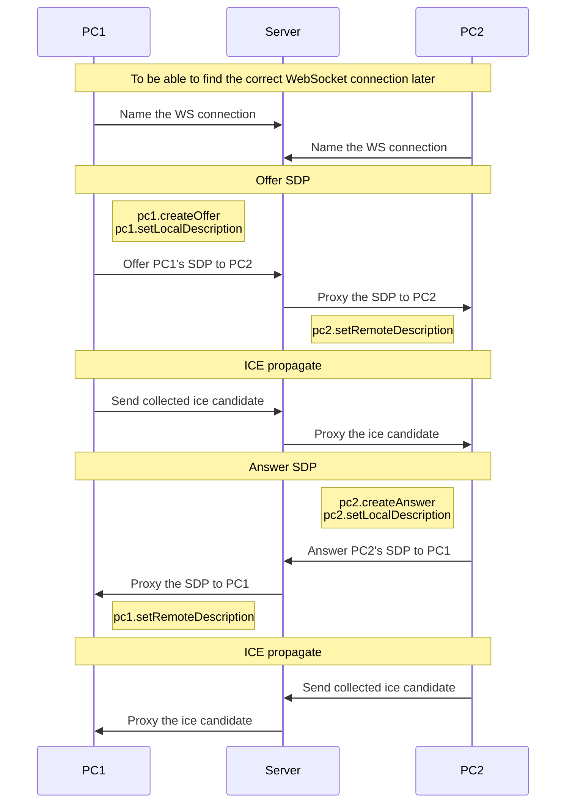

## Explain the events order


## How to use
### Build client
```sh
npm run build-client
```
### Build and start resource server
```sh
npm run build-server
npm start
```
### Start websocket server
```sh
npm run start-ws-server
```
### Demo
http://localhost:3000/index.html
